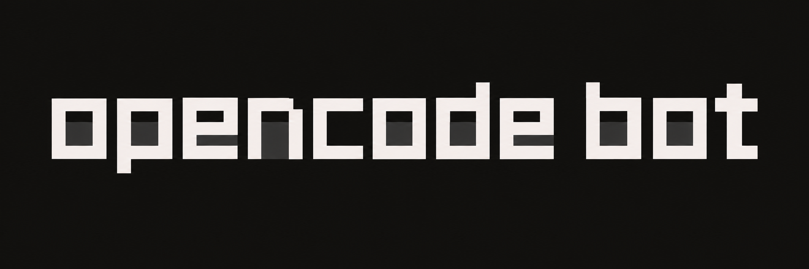

<p align="center">
  
</p>

<p align="center">
  <a href="https://github.com/pkyanam/opencode-bot/actions/workflows/ci.yml"></a>
  
  
  
</p>

# OpenCode Bot

[Website](https://pkyanam.github.io/opencode-bot/) · [Setup guide](docs/getting-started.md) · [Releases](https://github.com/pkyanam/opencode-bot/releases)

Give your bots a name, a job, and a computer. Chat in the browser or Telegram,
watch them work, and let them ask each other for help. Powered by
[OpenCode 2](https://opencode.ai/v2/docs/), hosted on your own Cloudflare account.

## Install

```bash
curl -fsSL https://raw.githubusercontent.com/pkyanam/opencode-bot/main/install.sh | bash
```

The installer deploys a pinned release to your Cloudflare account and opens the
workspace in your browser. Cloudflare pulls the prebuilt computer image directly;
**you do not need Docker or a Docker Hub account.**

**Prerequisites**

- macOS, Linux, or Windows with WSL2; Bash, `curl`, Git, and internet access.
- Cloudflare account with Workers Paid, Containers access, and R2 enabled.
- An interactive terminal for browser login and account selection, unless your
  agent already has Cloudflare credentials.

The script installs Node.js 24+ locally when needed and installs its pinned
**Wrangler** CLI through npm. It opens Cloudflare login if you are signed out.
On macOS, existing Homebrew can install missing Git; elsewhere, install Git first.
Cloudflare signup, billing activation, and login consent may need you.

Your first computer can take a few minutes to start; explore the workspace while
it boots. The default checkout is `~/.local/share/opencode-bot`. Rerun the command
to resume installation. Hosting and models are billed by their providers.
[Setup details and troubleshooting →](docs/getting-started.md)

### Uninstall

From your installation checkout:

```bash
npm run setup -- uninstall          # preview the exact resources
npm run setup -- uninstall --yes    # delete this installation
```

Removes the Worker, bot/conversation data, container, and R2 bucket. Add
`--keep-artifacts` to retain R2 files and checkpoints (conversations still get
deleted). Cleanup uses your existing Wrangler login, verifies ownership, and
can resume after a failure. Local source, credentials, and the deployment
journal remain on your computer.

### Or hand it to your agent

```text
Clone https://github.com/pkyanam/opencode-bot.git and set it up on my Cloudflare account. Read README.md and docs/getting-started.md, then run bash install.sh (or the documented setup apply flow from your checkout). Install missing prerequisites where possible, deploy the app, verify the authenticated API and computer, and open it connected in my browser. This authorizes the setup and deployment; handle routine steps yourself. Use existing credentials or ask only for login, account selection when ambiguous, billing activation, or secrets you cannot obtain. Keep tokens out of chat, logs, and Git. Report the URL and exactly what passed or remains blocked.
```

## A workspace that stays with you

- **Bots with their own identity.** Instructions, models, memory, and assigned
  skills carry into every new conversation. Rename or delete threads and bots.
- **See the work.** Markdown replies, live tool activity, approvals, and an
  expandable view of the browser your bots control. Take over the shared desktop
  to sign in directly, then return control. [Computer controls](docs/computer-control.md).
- **Talk to the right bot.** Bots can ask peers for help and bring their replies
  back into your conversation, and create new persistent bots on request.
- **OpenCode underneath.** Model and provider setup, API keys, native commands,
  and a built-in terminal. Browse GitHub skill repositories, inspect and install
  skills with their supporting files, or manage pinned npm plugins under Skills.
- **Connect MCP services.** Settings → MCP services, `/mcps`, and `/mcp` expose
  the installed runtime's service status and supported connect/sign-in flows.
  Sign in from your own browser and resume pending logins in Settings.
  See [service authentication](docs/mcp-service-auth.md). The web command
  menu is a curated runtime catalog; use Native OpenCode for the full TUI/CLI.
- **Take it to Telegram.** Connect a BotFather bot, scan the pairing link, and
  receive formatted replies and progress. Local mode uses polling; Cloudflare
  uses HTTPS webhooks.
- **Send the source material.** Attach images and files in web chat or Telegram.
  On mobile, take a photo, choose from the photo library, or choose a file.
  Supported images reach the model; other files are available in its workspace.
- **Pair another client.** Settings → Devices gives you a one-use code or QR.
  Each trusted browser or client gets an independently revocable credential.
  External agents can connect through the [authenticated MCP endpoint](docs/mcp.md).
- **Keep talking.** Messages sent during a turn enter OpenCode’s native steering
  inbox; work for a busy computer stays queued. Stop works while awaiting approval.
- **Update from Settings.** Connect deployment access once, then update the app
  and computer together with a saved checkpoint.
- **Bring another computer.** Settings → Computers provides a copyable one-line
  installer for macOS/Linux or Windows. It accepts the pairing token, installs
  the runtime, pairs the machine, and starts its background service without a Git
  checkout.
- **Browse your computers.** Files offers Workspace and Computer views. Choose a
  computer, open an absolute path, preview Markdown and images, or upload, download,
  rename, and remove files. [Computers, models, and access](docs/node-affinity.md).
- **Manage storage.** Settings → Storage shows measured deployment R2 usage,
  configures idle checkpoints, and lets you discard selected unprotected old
  backups. The account-wide 10 GB-month free allowance is shared across
  deployments and is not a dedicated quota or billing guarantee. Containers
  also require Workers Paid plus compute, memory, and awake disk charges, so
  the R2 meter is not a full deployment cost estimate. See [R2 pricing](https://developers.cloudflare.com/r2/pricing/)
  and [Containers pricing](https://developers.cloudflare.com/containers/platform/pricing/).

## Mobile preview

The first native iOS/Android client is in [apps/mobile](apps/mobile). Scan the QR
from Settings → Devices or enter a one-use code to connect. It shares your bots,
conversations, approvals, and files with the web app. Device credentials stay in
secure storage. [Build and run the mobile app →](docs/mobile-client.md)

This is a development preview, not an App Store or Play Store release.

## First public preview

This is a personal, single-owner app. Bots sharing a computer share its files,
browser, and credentials. Desktop streaming, deletion, and extension installation for additional nodes,
along with native desktop packaging, are still in development.

Sandbox disk is ephemeral. Use **Computer → Checkpoint** while idle to preserve
it in R2; Cloudflare checkpoints support archives up to 2 GiB using multipart R2 storage. Keep your owner
token private. See [operations](docs/05-operations.md) and [security](SECURITY.md).

## Develop

With Node.js 24+ and Docker running:

```bash
git clone https://github.com/pkyanam/opencode-bot.git
cd opencode-bot
npm ci
npm run build
npm run preview:worker -- --var APP_TOKEN:local-preview-token --var RUNNER_TOKEN:local-runner-token
# In another terminal, from the same directory:
npm run dev
```

Open [localhost:5173](http://localhost:5173), then use `local-preview-token` in
**Settings → Connection**. These example tokens are for local development only.
Run `npm run typecheck && npm test` to verify changes.

## Under the hood

React + shadcn/ui · Cloudflare Workers · SQLite Durable Objects · Sandbox · R2.

[Getting started](docs/getting-started.md) · [Architecture](docs/02-design.md) ·
[Research](docs/01-research.md) · [Skills & plugins](docs/10-extensions.md) ·
[Mobile client plan](docs/mobile-client.md) · [Desktop plan](docs/06-desktop.md) · [Release pipeline](docs/releasing.md) · [Test evidence](tests/qualification/README.md)

[MIT licensed](LICENSE). Independent community project;
[acknowledgments and trademarks](NOTICE.md).
