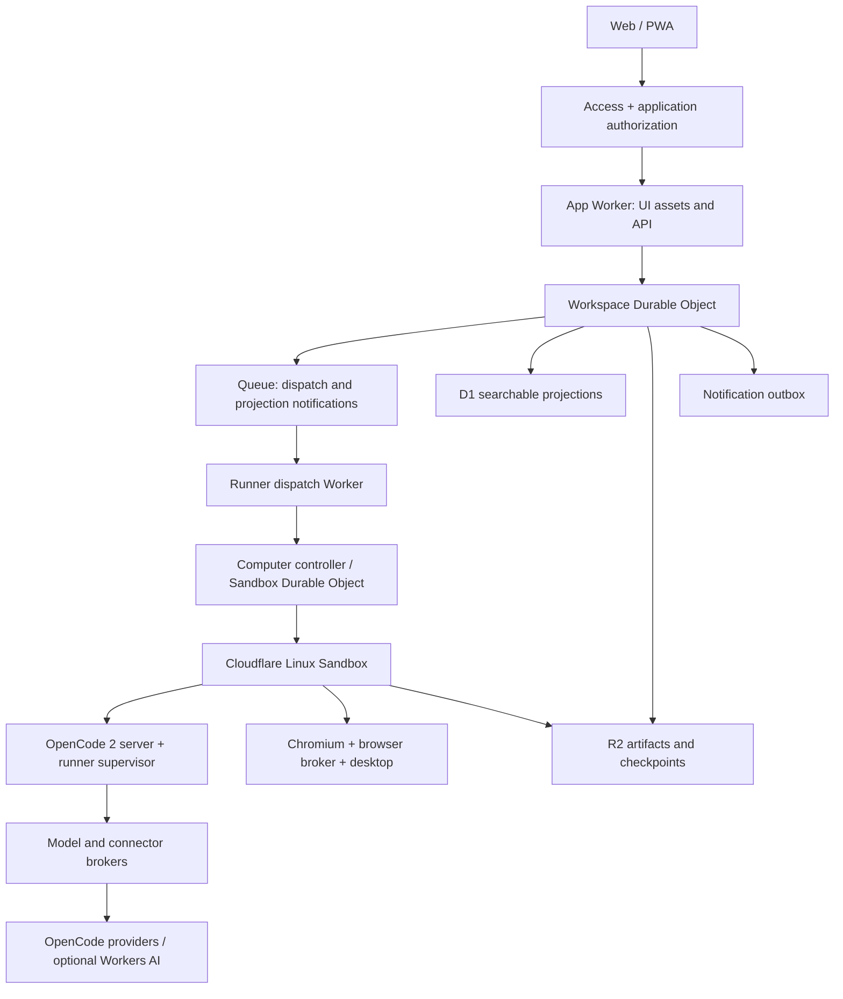
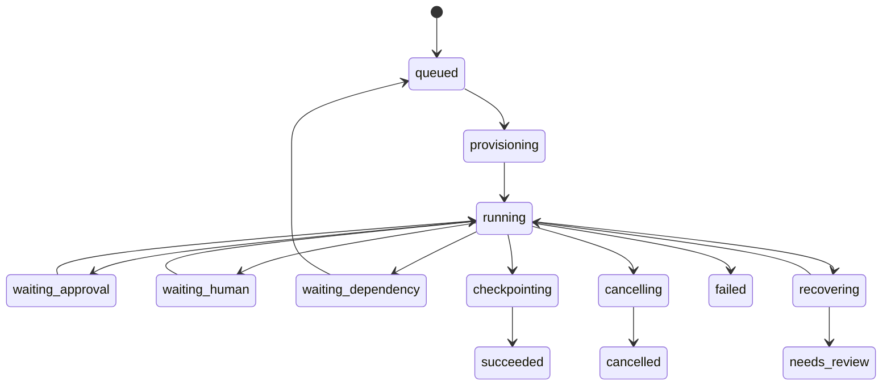

# Proposed system design

**Decision:** ship a single-owner, Cloudflare-hosted bot workspace first. Use OpenCode 2's real CLI/server in a Cloudflare Linux Sandbox. Keep computer hosting, agent runtime, browser, model provider, and integrations independently replaceable.

Everything in this document is a proposed architecture, not a claim that the repository already implements it. See the research dossier for verified upstream capabilities.

## Product contract

The user creates a bot by describing its job. They can assign work, leave the app, inspect results, approve an action, take over the computer, and schedule a successful workflow. A bot retains its identity and curated memory even when an OpenCode session is rotated or a computer is recreated.

Start with one workspace owned by one person. It has one shared computer, several bots, and one authenticated web/PWA interface. Bots are collaborators inside that workspace's trust boundary. Multiple users and separate trust domains require separate computers and credentials, not merely separate bot prompts.

Definitions:

| Object | Responsibility |
|---|---|
| Workspace | Ownership, security boundary, budgets, shared resources |
| Bot | Durable role, preferences, memory, tool grants, default model |
| Thread | User-facing conversation; may include several bots |
| Task | Desired outcome, acceptance criteria, current owner |
| Run | One bounded execution attempt for a task |
| Runtime session | OpenCode conversation/execution context; linked to a run and bot |
| Computer | Replaceable execution environment with declared capabilities |
| Skill | Versioned reusable method and validation criteria |
| Routine | Trigger plus pinned skill/instructions and owning bot |
| Action | A concrete operation that may have an external side effect |
| Approval | Decision bound to the exact action, scope, version, and expiry |

The product exposes different pause controls: stop the current run, pause a routine, pause all bot work, or stop the computer. Hiding a bot does not implicitly pause it. Destructive deletion spells out what happens to history, shared files, schedules, backups, and credentials.

## Initial architecture



The R2 arrow from the sandbox represents scoped upload/download operations through the trusted broker or short-lived signed URLs, not an account-wide storage credential inside the sandbox.

| Module | Initial implementation | Replaceable through |
|---|---|---|
| Application API and web UI | TypeScript Worker, React/PWA assets | HTTP/event contract |
| Coordination | SQLite-backed Workspace Durable Object | Coordinator interface |
| Durable file/blob storage | R2 | BlobStore interface |
| Search and list projections | D1 | QueryStore interface |
| Dispatch delivery | Cloudflare Queues | JobQueue interface |
| Computer lifecycle | Cloudflare Sandbox | ComputerProvider interface |
| Agent runtime | Pinned OpenCode 2 server/client | AgentRuntime interface |
| Browser and desktop | Chromium, Playwright/CDP broker, Xvfb/noVNC | BrowserProvider and DesktopProvider |
| Models | OpenCode providers through an authenticated broker | Provider configuration/protocol adapters |
| Connectors | Worker-hosted OAuth/API/MCP broker | Connector interface |
| Authentication | Cloudflare Access initially | IdentityProvider interface |
| Scheduling | Durable Object alarms with Cron reconciliation | Scheduler interface |

Use Workflows later for coarse business processes with multi-day waits if they simplify the product. Do not place a second reasoning loop around OpenCode or make each streamed token a Workflow step. Vectorize is optional after memory retrieval quality demonstrates a need. A simple keyword search and explicit memory references are sufficient initially.

### Why put the CLI on the computer first?

This keeps shell, file paths, MCP processes, source trees, and computer tools close to the runtime. The same runner works on Cloudflare, a local Linux container, Boat, or Daytona. It also honors the user's request to use `opencode2` directly.

The tradeoff is that OpenCode's database must be checkpointed, and the sandbox stays awake while the model is reasoning. The embedded Workerd runtime can remove that coupling and store session state directly in Durable Object SQLite. It requires remote replacements for filesystem/shell tools, bundled compatible plugins, and demonstrated eviction/replay correctness. Treat it as a first-class future adapter, with a qualification spike before changing the default. [Official Workerd profile](https://opencode.ai/v2/docs/build/sdk/cloudflare/).

A runtime choice is per bot/session generation, not an invisible per-message optimization. Switching runtime creates a new session from explicit context or a tested import; portable transcript export does not guarantee lossless restoration of internal reasoning or encrypted provider checkpoints.

## Module contracts

These TypeScript interfaces define our boundary; they are not copied Cloudflare or OpenCode method signatures.

```ts
type ComputerCapabilities = {
  os: "linux" | "macos" | "windows";
  shell: boolean;
  desktop: boolean;
  browser: boolean;
  durableDisk: boolean;
  snapshots: boolean;
  enforcedEgress: boolean;
  maxParallelScreens: number;
};

interface ComputerProvider {
  capabilities(): Promise<ComputerCapabilities>;
  ensure(spec: ComputerSpec, key: string): Promise<ComputerHandle>;
  inspect(id: string): Promise<ComputerStatus>;
  connect(id: string, lease: RunnerLease): Promise<RunnerTransport>;
  checkpoint(id: string, fence: number): Promise<CheckpointManifest>;
  restore(id: string, checkpoint: CheckpointManifest): Promise<void>;
  stop(id: string, mode: "graceful" | "force"): Promise<void>;
  destroy(id: string): Promise<void>;
}

interface AgentRuntime {
  inspect(): Promise<RuntimeCapabilities>;
  createSession(spec: SessionSpec, idempotencyKey: string): Promise<SessionRef>;
  submit(session: SessionRef, input: RunInput): Promise<AdmissionReceipt>;
  observe(session: SessionRef, cursor?: string): AsyncIterable<RuntimeEvent>;
  reconcile(session: SessionRef, cursor?: string): Promise<SessionSnapshot>;
  replyApproval(request: RuntimeApprovalReply): Promise<void>;
  interrupt(session: SessionRef): Promise<void>;
  exportContext(session: SessionRef): Promise<PortableContext>;
}
```

All mutations include workspace identity, run identity, a command ID, and a generation/fencing token in the authenticated envelope. Provider IDs and filesystem paths are derived from trusted records. Never let a browser request choose another workspace's sandbox ID.

Capabilities describe enforcement as well as functionality. A local runner without enforced egress cannot satisfy a policy requiring destination confinement. The UI must surface that incompatibility rather than quietly weakening the policy.

### Runtime adapter

Pin `@opencode/cli` and `@opencode/client` to a qualified pair. Use the published release's client and schema, not internal source imports. Store a contract fingerprint and probe required operations at startup. The V2 API explicitly labels surfaces experimental. [V2 API](https://opencode.ai/v2/docs/api).

The adapter maps our session lifecycle to creation, prompt admission, status, events, interruption, permission reply, forms, and context export. It maintains a mapping from our IDs to upstream IDs. It must distinguish a prompt being accepted from execution being completed.

The global stream is a latency channel, not a journal. Reconcile gaps from the qualified session-log API and message/status queries, then assign durable application event sequence numbers. If upstream lacks a replay operation in a supported release, record events continuously and mark unexplained gaps explicitly. Never silently fabricate lost tool output.

Use our own output schema for artifacts, approval cards, and final results. User-facing summaries should include completed work, evidence, validation, partial failures, and next required input. Keep raw provider reasoning out of product promises and treat it according to available provider output and retention policy.

## State ownership and storage

Avoid two writable sources of truth. For the first single-owner workspace:

| Data | Authoritative location | Notes |
|---|---|---|
| Bots, threads, task ownership, routines, approvals | Workspace DO SQLite | Serialized coordination and transactions |
| Accepted messages, run states, policy versions, usage reservations | Workspace DO SQLite | Admission is durable before acknowledgement |
| Search/list indexes | D1 | Rebuildable projections with version numbers |
| OpenCode session internals | Runtime's SQLite; checkpointed to R2 | Internal implementation, never edited directly |
| Files and browser profile | Sandbox working disk + committed checkpoint | Working state is not inherently durable |
| Artifact bytes, transcript archives, backups | R2 | Immutable keys, checksums, explicit retention |
| Connector secrets | Encrypted records; wrapping key in Worker secret | Decrypted only in broker |
| Model-provider credentials | Worker secrets for initial single owner | Scoped broker injects credentials |
| UI live connections | Workspace DO WebSockets | Reconnect from persisted application cursor |

Initial tables include `bots`, `threads`, `thread_members`, `messages`, `tasks`, `runs`, `runtime_sessions`, `computers`, `leases`, `skills`, `routines`, `routine_occurrences`, `memory_items`, `connections`, `actions`, `approvals`, `artifact_manifests`, `usage_reservations`, `events`, `outbox`, and `inbox_dedup`.

Every record has an ID, workspace ID, timestamps, and schema version. Mutable coordination records have a revision. Important uniqueness constraints include `(routine_id, scheduled_instant)`, `(producer_id, message_id)`, `(run_id, action_key)`, and `(computer_id, lease_generation)`.

The DO transaction writes state plus an outbox entry together. An alarm/dispatcher retries delivery; Queues wakes consumers. Consumers deduplicate receipts and project D1 with monotonically increasing versions. Queue acknowledgement happens after durable receipt, not after a multi-hour agent job. A queue message is a wakeup, not the only copy of the job. Cloudflare documents at-least-once delivery. [Queues guarantees](https://developers.cloudflare.com/queues/reference/delivery-guarantees/).

Archive old event segments into R2 and retain a bounded live tail plus indexes in the DO. Never delete an event segment until its immutable archive and checksum are committed. Attachments, screenshots, and large tool outputs belong in blob storage, not in hot coordination rows. D1 searches return IDs that are reauthorized against authoritative workspace membership before content is returned.

## Execution, steering, and recovery



Terminal transitions also apply from other nonterminal states where appropriate. Each transition records a cause and authoritative actor. Approval waits, human waits, and dependency waits are separate so the product can notify accurately and avoid unnecessary compute.

Normal flow:

1. Authenticate a message, assign an idempotency key, and commit it with a task/run record.
2. Check owner concurrency, budget reservation, and current policy. Queue a dispatch wakeup.
3. Acquire the computer's generation lease. Restore its last committed checkpoint if needed.
4. Start or discover the exact pinned OpenCode server. Probe identity and readiness.
5. Load the bot's role, selected model, approved skills, relevant memory, and scoped tool grants.
6. Create/resume the mapped session and submit the input exactly once where the upstream admission contract allows. Persist the admission receipt.
7. Relay normalized events and reconcile stream gaps. Publish artifacts through the blob broker.
8. Checkpoint durable results; commit completion only after result manifests exist. Notify the user.

If submission times out, query the runtime for the admitted input ID before retrying. Where the upstream contract cannot distinguish an accepted input, transition to reconciliation rather than blindly resubmitting. Exactly-once external work is not guaranteed by durable prompt admission.

User steering adds a priority input. Use native inbox/interrupt behavior where qualified; otherwise interrupt at a safe boundary and submit a follow-up after confirming quiescence. Cancel revokes pending action grants, requests interruption, and stops child processes when required. A browser click already sent cannot be recalled.

Every external action follows `prepared → authorized → dispatched → confirmed`, with `unknown` for timeout/crash after dispatch. Record an action key before executing. Supply provider idempotency keys when available. Otherwise reconcile the remote object or ask for review. Never automatically repeat an unknown send, purchase, or deletion.

The runner renews a bounded lease. On lease loss it stops accepting new commands; the broker rejects stale generations. On takeover, revoke the old generation before enabling the replacement. Direct browser access cannot offer the same transaction guarantees as a brokered API: ambiguous effects must remain visible.

## The computer

Build a versioned Linux image containing the pinned OpenCode CLI, Node, Python, Git, required document tools, Chromium, Playwright, a lightweight X server/window manager, noVNC/websockify, and our supervisor. Keep development caches and optional large packages out of the persistent state by default. This desktop stack is a proposed integration, not a native Cloudflare desktop product.

Suggested layout:

```text
/opt/opencode-bot/                 immutable runner and tools
/workspace/shared/                collaboration files
/workspace/projects/<project>/    source and worktrees
/workspace/bots/<bot>/             bot-owned working files
/workspace/.runtime/               explicit OpenCode data/config/state roots
/workspace/.browser/               browser profiles and auth state
/tmp/                             disposable scratch
```

Discover actual OpenCode paths with the pinned release's path/config tooling. Use isolated runtime roots; do not import the operator's entire home, SSH directory, browser profile, or provider account database.

Initially allow one active GUI controller per computer and a small configurable number of non-GUI runs. Separate directories help coordination but are not security isolation. Serialize writes to the same project or use separate Git worktrees. File publication is atomic through a temporary file plus rename where the filesystem supports it.

Later, add multiple displays or browser contexts. Do not open the same Chromium user-data directory in several independent browser processes. Choose one browser owner with multiple targets, or separate profiles with explicit login provisioning. Sharing cookies across accounts or trust domains is never an optimization.

### Persistence contract

Cloudflare's working disk can disappear on replacement. R2/FUSE is not the live home for SQLite WAL databases or an active Chromium profile. Use local disk while running and consistent snapshots for durability. [Cloudflare backup behavior](https://developers.cloudflare.com/sandbox/guides/backup-restore/).

Checkpoint procedure:

1. Acquire an exclusive checkpoint barrier; stop admitting new file-changing work.
2. Reach a safe tool boundary and quiesce browser/profile writers. Use a SQLite online backup or stop the DB writer; copying only the main SQLite file is insufficient.
3. Produce a manifest with computer generation, runtime/image versions, session mappings, event watermark, included paths, checksums, and browser-profile version.
4. Upload immutable chunks and verify availability. Commit the manifest pointer only after all required objects exist.
5. Release the barrier. A normal sleep is allowed only after that commit.

Checkpoint at task completion, before controlled sleep, before upgrade, and periodically at safe boundaries for long work. Large repositories may need incremental/chunked uploads; measure the cost before choosing a timer. Exclude disposable caches, never required browser/auth files merely because they are gitignored.

Use explicit backup retention exceeding the maximum idle interval. The stable Sandbox backup handle has expiry semantics; a last-known-good checkpoint must remain restorable after a long vacation. Either manage an unexpired supported handle or maintain an application-owned archival format with tested extraction. Do not let object retention and handle expiry drift apart.

On crash, control-plane messages and approved action records survive immediately; workspace bytes may revert to the last committed checkpoint. Show that recovery point to the user. Initial target: no acknowledged control-plane message loss, and best-effort computer-state loss bounded by checkpoint age. This is a target, not a zero-loss claim.

Recovery restarts processes; it does not resurrect an in-flight native process stack. Reconcile external actions against the control-plane ledger before resuming the agent, especially when its restored local transcript predates a completed remote mutation.

## Browser and computer use

Prefer structured connector operations, then semantic browser automation, then screenshot/coordinate interaction. Use terminal tools for file transformations and development tasks. The model must explicitly support the chosen observation format.

Expose browser operations through a broker: inspect page/accessibility tree, navigate, screenshot, click a referenced element, type, select, upload/download, and wait for a condition. Each operation carries the computer generation, target ID, and control lease. Model-visible image coordinates must match screenshot dimensions and scaling.

The Computer panel shows current state, selected tab/display, live view, files, and terminal. “Take control” atomically revokes automated GUI control. Automation pauses and new screenshots are suppressed while a sensitive login is entered. “Return control” captures fresh state before work resumes. A password dialog should never require a secret in chat.

A local Chromium profile is the initial path for full-computer compatibility. Cloudflare Browser Run is an optional managed browser adapter with Live View and human intervention; it still needs explicit auth-state handling and recovery. Its live-view URLs are bearer credentials and cannot be stored in ordinary transcripts. [Live View](https://developers.cloudflare.com/browser-run/features/live-view/).

Hardware-backed passkeys and desktop-bound sessions may not work in a remote browser. Provide a clean handoff/reconnect state. Do not advertise universal website support or hardware-key forwarding in the first release.

## Connectors, credentials, and authority

The connector broker owns OAuth authorization, refresh, revocation, scope inventory, and provider-specific APIs. A plugin/MCP tool receives a short-lived capability tied to a workspace/run and operation, not an unrestricted provider refresh token. Refresh operations use a single-flight lock and persist replacement tokens atomically.

First connector: GitHub, with narrow repository selection and read/draft-PR operations. Add messaging or document connectors as separate packages. Every connector declares input/output schemas, read/write classification, required scopes, idempotency behavior, and reconciliation strategy. Adding a connector does not implicitly enable its event triggers.

Store model keys in a trusted Worker broker; preserve provider protocol and streaming. Enforce destination/path/model constraints and strip caller-supplied authorization before injecting a key. Native provider-hosted tool charges need separate accounting where exposed. Optional AI Gateway adds visibility, but it is not mandatory and does not turn external inference into Cloudflare-hosted inference.

For single-owner deployments, a wrapping key in Worker secrets encrypts dynamic credential records. Record key versions for rotation. An administrator controlling the deployment can ultimately access its data; this is not end-to-end encryption against the host operator. Browser cookies necessarily exist on the computer and must be handled as credentials in backups.

### Approval enforcement

Evaluate authority before execution:

1. Workspace policy and runtime capability constraints.
2. Bot/run grants derived from the user's actual request.
3. A broker-side action check against exact normalized inputs.
4. Optional model review for ambiguous intent or browser actions.
5. Durable human approval only where the configured policy requires it.

An approval binds the action hash, destination, parameters, resource revision, run, expiry, and policy version. Input changes invalidate it. Clicking “allow once” consumes a single-use grant. Replayed approval requests must not create duplicate grants.

Model review cannot grant a capability the workspace policy denies. Tool hooks improve visibility but are not an OS security boundary. A bot with unrestricted shell access to an authenticated browser profile can bypass a wrapper. Therefore initial mode is explicitly a **trusted shared personal computer**. Workflows requiring strong per-action confinement use a separate credential-free execution sandbox and broker-only access to the authenticated browser/connectors; that hardened topology is a later release gate, not a claim about the default shared image.

Cloudflare outbound controls allow destination filtering and trusted credential injection. Validate raw sockets, WebSockets, redirects, DNS, and HTTPS behavior in the chosen SDK/image. An HTTP method allowlist is not a general read-only guarantee: many reads use POST and some unsafe sites mutate through GET. [Sandbox outbound controls](https://developers.cloudflare.com/sandbox/guides/outbound-traffic/).

## Memory, skills, and collaboration

Memory has three layers: explicit role instructions, curated durable facts/preferences, and searchable past work. A memory item records source message/document, author, scope, confidence, freshness, and superseded/deleted state. Bots propose durable memory changes; users can inspect and correct them. Never promote instructions from an untrusted webpage into policy.

At run admission, build a bounded context packet: role, active task, latest user directions, relevant memory, skill version, and artifact references. OpenCode owns the active-session compaction; our memory service owns cross-session recall. Keep important facts linked to current sources rather than relying on summaries forever.

Skills are content-addressed bundles with inputs, procedure, validation, expected output, and required grants. Version and review changes. Demonstration capture records semantic browser actions and sanitized observations, produces a draft skill, and runs it on a safe example before scheduling.

A bot mailbox message includes sender, recipient, task, requested deliverable, available grants, deadline, and reply route. Receiving a message does not expand permissions. Use a durable inbox with deduplication; acknowledge receipt independently of task completion.

A task has one owner at a time. Ownership transfer is a compare-and-swap operation, with a lease and an explicit accepted handoff. Shared artifacts are immutable references. Bounded delegation depth, total run count, and common budget prevent bot loops. Start with direct handoffs; group conversations are a view over the same task/mailbox records.

## Scheduling and notifications

Store timezone-aware schedules and the next UTC occurrence. Define daylight-saving behavior, missed-run policy, overlap policy, and catch-up limit. Default to coalescing missed routine runs and preventing overlapping runs for the same routine. The occurrence key makes an alarm retry and a Cron sweep converge on one run.

An alarm dispatches the next due occurrence; a periodic Cron reconciliation checks missed alarms and stale leases. Routines run from explicit instructions and a pinned skill version. They cannot silently inherit a newly broadened connector scope or a changed model-vendor fallback.

Each DO has only one alarm, so store all scheduled deadlines and arm the earliest one across routines, leases, and outbox retries. Process a bounded batch and re-arm from persisted state; one subsystem must not overwrite another's wakeup. Alarm delivery is at least once and automatic retries are finite, which is why the independent Cron reconciliation remains useful. [Durable Object alarms](https://developers.cloudflare.com/durable-objects/api/alarms/).

Notify on completion, required input, failure, or a meaningful monitored change. Avoid repeated unchanged progress alerts. Start with in-app status and optional web push. Additional email/chat notification delivery is an adapter configured by the owner, with its own deduplication key and delivery history.

## User interface

Use a responsive web app first. The sidebar contains bots, groups, routines, files, and settings. Each bot conversation has a status indicator and inline activity. A right-side Computer panel opens only when useful; the user can inspect artifacts without navigating the desktop.

Approval cards show a concrete action and target. Recovery notices state what was restored and what remains uncertain. A run details view shows model/provider, cost estimate, sources, outputs, and validation. Settings expose computer backend, model policy, credentials, memory, budgets, backup status, and export.

Bot creation remains conversational, but the resulting role, tools, and schedule are editable structured records. The interface must not hide policy changes inside a wall of generated prose.

## Portability

The runner initiates an outbound authenticated connection for local/private machines. It registers capabilities, accepts leased commands, publishes events, and uploads artifacts. No inbound router port is required. A disconnected laptop moves tasks to `waiting_computer`; another backend is used only under an explicit failover policy.

Boat and Daytona adapters implement provisioning, lifecycle, transport, and snapshots while the common runner supplies OpenCode/browser behavior. Generic VMs use the same image or a native runner where containers are unsuitable. macOS native automation needs an OS-specific desktop adapter and user-granted OS permissions.

Export bots, memory, skills, schedules, transcripts, artifact manifests, and portable workspace files. Exclude credentials by default. Record platform-specific state that cannot be transferred, such as browser keychain dependencies. A backup clone never starts with active write credentials until ownership and generation are re-established.

The long-term fully local profile replaces Workers/DO/D1/Queues/R2 with a Node service, SQLite, a local queue/scheduler, and filesystem/S3 storage. Keep that outside the first implementation, while avoiding Cloudflare bindings in domain-level interfaces.
