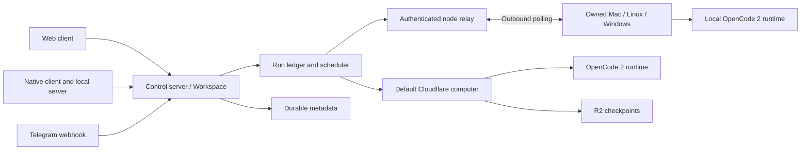

# Product decisions from Grok Bot, Hermes, and OpenClaw

Research checked September 20, 2026. This document separates observed behavior from our design decisions. See [the original research](01-research.md) for OpenCode 2 API and Cloudflare implementation evidence.

## Grok Bot: persistent roles, a visible computer

Grok Bot centers a named bot with a job, accumulated context, and a persistent computer. Bots within one account share files, browser sessions, and app logins; separate bot screens are workspaces rather than isolation boundaries. Its documentation describes concurrent reasoning and tool work, with a single computer-use task per bot screen. Human takeover handles login and other interactive gates. [Overview](https://docs.x.ai/grok-bot/overview), [getting started](https://docs.x.ai/grok-bot/get-started).

Our decision: keep conversations central, put skills and files in the workspace navigation, and put the live computer beside the conversation in a collapsible pane. Keep application settings separate from a bot's instructions. The present implementation serializes work on its shared computer. Multiple bot identities do not imply filesystem or browser-account isolation. A future isolated-computer mode must have separate storage roots and credentials, not merely separate windows.

## Hermes: procedures and memory are different products

Hermes stores procedural skills as SKILL.md bundles with referenced support files. Its installation workflow records provenance and scans bundles in quarantine. That makes a skill a portable workflow rather than another chat prompt. [Skills](https://hermes-agent.nousresearch.com/docs/user-guide/features/skills/).

Hermes distinguishes agent notes from a user profile and provides history search beyond these compact memories. Its documentation emphasizes that an actual memory write matters; a model saying it remembered something is insufficient. Session boundaries refresh the memory snapshot. [Memory](https://hermes-agent.nousresearch.com/docs/user-guide/features/memory/).

Our decision: make saved memory visible and editable per bot, separate it from executable/reusable skills, and inject the current stored material into each OpenCode session through the native instructions API. Next, add source-attributed memory proposals with accept/reject controls, portable skill bundles, and version history. Do not silently turn chat claims into durable memory.

Hermes's Telegram adapter distinguishes individual sender allowlists from whole-group authorization. [Telegram](https://hermes-agent.nousresearch.com/docs/user-guide/messaging/telegram/).

Our decision: begin with explicit private-chat pairing to a particular bot and conversation. A BotFather token connects the service; a separate expiring deep link authorizes the user's chat. Group membership alone must not grant access. Voice notes, attachments, group topics, and approval buttons are separate channel capabilities to add after the text route is qualified.

## OpenClaw: a gateway and device capabilities

OpenClaw separates a gateway from companion nodes. Nodes expose declared device capabilities through authenticated communication. Channel messages arrive at the gateway. Its node documentation distinguishes session hosting, command policy, local tools, file transfer, and computer use. [Nodes](https://docs.openclaw.ai/nodes).

Our decision: Cloudflare is the default control server and computer, while owned machines join using outbound connections. Registration, heartbeat, revocation, and job leases are independent of the OpenCode runtime adapter. A disconnected node must never trigger a silent replay of possibly completed work. Capability reporting must describe available services, not merely an OS label.

## Target topology

The diagram is the target architecture. Cloudflare run dispatch, native
terminal, headed Chromium MJPEG desktop stream, and manual checkpoints are
implemented. Owned-node registration, bot/node selection, conversation
affinity, explicit runner jobs, cancellation forwarding, approval forwarding,
and completed-run receipt reconciliation are implemented. Remote owned-node
terminal/desktop relay and live native transcript browsing are unavailable;
completed remote transcripts arrive through durable receipts. The native
desktop shell remains planned in [the desktop design](06-desktop.md).

## Interaction rules

- A bot can own any number of named conversations. A conversation has one native session on one computer; moving it needs explicit migration.
- Model names truncate in compact navigation and remain fully readable in the upward-opening catalog. Searching does not change the selected model.
- Message order comes from creation timestamps, never native API array order.
- Failed messages carry their provider explanation. Retries are visible during execution; empty native assistant records are not successful replies.
- One Settings entry owns connection credentials, computers, Telegram, and runtime information.
- Local runner listeners bind to loopback. Only the container image opts into binding its private container interface.
- A QR encodes a Telegram bot deep link. It is not Telegram account-login authentication.
- A successful Bot API send cannot be atomically committed with our SQL transaction. Ambiguous delivery becomes needs_review rather than automatically sending twice.

## Remaining acceptance gates

Native installers must bundle the correct platform client/server binaries,
register background services, sign updates, and test uninstall/data
preservation. Cloud deployment must qualify real container lifecycle and R2
recovery. Additional nodes still need remote terminal/desktop relay, live
transcripts, and explicit resource policy before broader automatic placement is
enabled; current run routing preserves the selected bot/thread affinity and
reconciles completed work through receipts. A user-created BotFather bot has
now been paired and delivered two live Muse text replies, with durable delivery
records reaching `sent`; a second reply also completed a computer-hardware tool
run. Live command handling such as `/new` still needs qualification. Local
polling requires no HTTPS; the Cloudflare webhook option requires a reachable
HTTPS deployment. Automated tests use a mocked Bot API and real SQLite
persistence.
